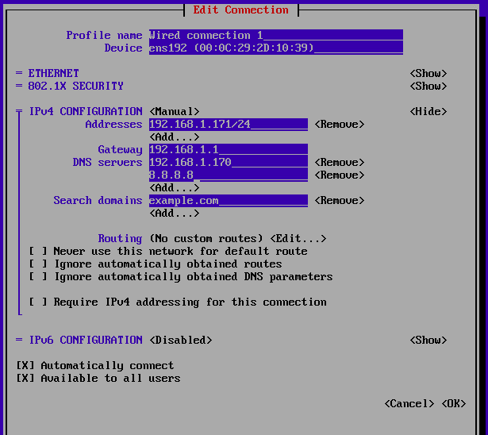

# Install OCP UPI

```
In the lab installation I am using following machines with their respective IP addresses.
```

| Hostname | IP address     | Description                       | Hardware Requirement | 
| :-------- | :------- | :-------------------------------- | :------------------- |
| `service.example.com`      | `192.168.1.170` | `Bastion/helper Node` | 16 GB RAM  - 60GB HDD - 4 CPU |
| `bootstrap.example.com`      | `192.168.1.171` | `Bootstrap Node` | 16 GB RAM  - 60GB HDD - 4 CPU |
| `worker1.example.com`      | `192.168.1.172` | `Master Node` |16 GB RAM  - 60GB HDD - 4 CPU |
| `worker2.example.com`      | `192.168.1.173` | `Master Node` |16 GB RAM  - 60GB HDD - 4 CPU |
| `worker3.example.com`      | `192.168.1.174` | `Master Node` |16 GB RAM  - 60GB HDD - 4 CPU |


First configure the Bastion Node with **Httpd**, **DNS** and **Haproxy** services.

```bash
# yum install -y httpd bind bind-utils haproxy
```


Configure DNS on Bastion Node

```bash
# cat /etc/named.conf
# ip=`ip addr show | grep -oE 'inet ([0-9]*\.){3}[0-9]*' | awk '$2 !~ /^127\./ {print $2}'`
# sed -i "s/listen-on port 53 { 127.0.0.1; };/listen-on port 53 { $ip; };/g" /etc/named.conf
# ip_with_suffix=` ip addr show | grep -v '127.0.0.1' | awk '/inet / {split($2, a, "/"); split(a[1], b, "."); print b[1]"."b[2]"."b[3]".0/"a[2]}'`
# sed -i "s/allow-query     { localhost; };/allow-query     { ${ip_with_suffix//\//\\/}; };/g" /etc/named.conf

```

Add Zone file reference in /etc/named.conf

```bash
# vim /etc/named.conf

zone "example.com" IN {
        type master;
        file "forward";
};


zone "1.168.192.in-addr.arpa" IN {
        type master;
        file "reverse";
};

```


Now create the zone files

```bash
# cp /var/named/named.localhost /var/named/forward
# vim /var/named/forward
$TTL 1D
@       IN SOA  root.example.com service.example.com. (
                                        0       ; serial
                                        1D      ; refresh
                                        1H      ; retry
                                        1W      ; expire
                                        3H )    ; minimum
@       IN      NS      service.example.com.
@       IN      A       192.168.1.170


service.example.com.            IN      A       192.168.1.170
service.lab.example.com.        IN      A       192.168.1.170

api.lab.example.com.            IN      A       192.168.1.170
api-int.lab.example.com.        IN      A       192.168.1.170
*.apps.lab.example.com.         IN      A       192.168.1.170

bootstrap.lab.example.com.      IN      A       192.168.1.171
master1.lab.example.com.        IN      A       192.168.1.172
master2.lab.example.com.        IN      A       192.168.1.173
master3.lab.example.com.        IN      A       192.168.1.174


```

Now modify the reverse file

```bash
# cp /var/named/forward /var/named/reverse

# vim /var/named/reverse
$TTL 1D
@       IN SOA  root.example.com service.example.com. (
                                        0       ; serial
                                        1D      ; refresh
                                        1H      ; retry
                                        1W      ; expire
                                        3H )    ; minimum
@       IN      NS      service.example.com.
@       IN      PTR     example.com.


170     IN      PTR     service.example.com.
170     IN      PTR     service.lab.example.com.


170     IN      PTR     api.lab.example.com.
170     IN      PTR     api-int.lab.example.com.


171     IN      PTR     bootstrap.lab.example.com.
172     IN      PTR     master1.lab.example.com.
173     IN      PTR     master2.lab.example.com.
174     IN      PTR     master3.lab.example.com.

```
Add following in the /etc/haproxy/haproxy.cfg file

```bash
# vim /etc/haproxy/haproxy.cfg

# Global settings
#---------------------------------------------------------------------
global
    maxconn     20000
    log         /dev/log local0 info
    chroot      /var/lib/haproxy
    pidfile     /var/run/haproxy.pid
    user        haproxy
    group       haproxy
    daemon

    # turn on stats unix socket
    stats socket /var/lib/haproxy/stats

#---------------------------------------------------------------------
# common defaults that all the 'listen' and 'backend' sections will
# use if not designated in their block
#---------------------------------------------------------------------
defaults
    log                     global
    mode                    http
    option                  httplog
    option                  dontlognull
    option http-server-close
    option redispatch
    option forwardfor       except 127.0.0.0/8
    retries                 3
    maxconn                 20000
    timeout http-request    10000ms
    timeout http-keep-alive 10000ms
    timeout check           10000ms
    timeout connect         40000ms
    timeout client          300000ms
    timeout server          300000ms
    timeout queue           50000ms

# Enable HAProxy stats
listen stats
    bind :9000
    stats uri /stats
    stats refresh 10000ms

# Kube API Server
frontend k8s_api_frontend
    bind :6443
    default_backend k8s_api_backend
    mode tcp

backend k8s_api_backend
    mode tcp
    balance source
    server      bootstrap 192.168.1.171:6443 check
    server      master1 192.168.1.172:6443 check
    server      master2 192.168.1.173:6443 check
    server      master3 192.168.1.174:6443 check

# OCP Machine Config Server
frontend ocp_machine_config_server_frontend
    mode tcp
    bind :22623
    default_backend ocp_machine_config_server_backend

backend ocp_machine_config_server_backend
    mode tcp
    balance source
    server      bootstrap 192.168.1.171:22623 check
    server      master1 192.168.1.172:22623 check
    server      master2 192.168.1.173:22623 check
    server      master3 192.168.1.174:22623 check

# OCP Ingress - layer 4 tcp mode for each. Ingress Controller will handle layer 7.
frontend ocp_http_ingress_frontend
    bind :80
    default_backend ocp_http_ingress_backend
    mode tcp

backend ocp_http_ingress_backend
    balance source
    mode tcp
    server      master1 192.168.1.172:80 check
    server      master2 192.168.1.173:80 check
    server      master3 192.168.1.174:80 check

frontend ocp_https_ingress_frontend
    bind *:443
    default_backend ocp_https_ingress_backend
    mode tcp

backend ocp_https_ingress_backend
    mode tcp
    balance source
    server      master1 192.168.1.172:443 check
    server      master2 192.168.1.173:443 check
    server      master3 192.168.1.174:443 check

```
Enable the SELinux boolean for Haproxy

 ```bash
 # setsebool -P haproxy_connect_any on
```

Start the Haproxy service

 ```bash
#  systemctl enable haproxy --now
```

Stop and disable the firewalld

 ```bash
# systemctl stop firewalld
# systemctl disable firewalld
```

Download and save the pull secret in a file

 ```bash
#  vim pull-secret.txt
```

Download the openshift-client-linux

 ```bash
# wget https://mirror.openshift.com/pub/openshift-v4/clients/ocp/latest-4.14/openshift-client-linux.tar.gz

```
Download the openshift-install-linux

 ```bash
# wget https://mirror.openshift.com/pub/openshift-v4/clients/ocp/latest-4.14/openshift-install-linux-4.14.20.tar.gz
```

Extract Both tar files

 ```bash
#  tar -xvf openshift-client-linux.tar.gz -C /usr/bin
#  tar -xvf openshift-install-linux-4.14.20.tar.gz -C /usr/bin -C /usr/bin
```
Check the version of installed commands
 ```bash
# oc version
# kubectl version
# openshift-install version
```
Create keygen for user, this keygen will be used in ignition to access the nodes.

 ```bash
# ssh-keygen
```
Create an install-config.yml file like below. Replace the basedomain, pullsecret and ssh key


 ```bash
# mkdir ocp4
# vim install-config.yml
apiVersion: v1
baseDomain: example.com
compute:
  - hyperthreading: Enabled
    name: worker
    replicas: 0
controlPlane:
  hyperthreading: Enabled
  name: master
  replicas: 3
metadata:
  name: lab # Cluster name
networking:
  clusterNetwork:
    - cidr: 10.128.0.0/14
      hostPrefix: 23
  networkType: OpenShiftSDN
  serviceNetwork:
    - 172.30.0.0/16
platform:
  none: {}
fips: false
pullSecret: '{"auths": ...}'
sshKey: "ssh-ed25519 AAAA..."
```

Create manifests

 ```bash
# openshift-install create manifests --dir=/root/ocp4
```

Create Ignition files

 ```bash
# openshift-install create ignition-configs --dir=/root/ocp4
```
Configure Apache

 ```bash
# mkdir /var/www/html/ocp4
# cp /root/ocp4/*.ign /var/www/html/ocp4
# restorecon -RFv /var/www/html/
# sed -i 's/Listen 80/Listen 8080/g' /etc/httpd/conf/httpd.conf
# systemctl enable httpd --now
```

**Installing Bootstrap node**

Power on the bootstrap machine with CoreOS ISO. Once machine is powered on, do the `network` setup.



After network setup, activate the connection and try to ping service.example.com to verify that network is properly configured and DNS is working.

```bash
$ ping service.example.com
```


Apply the ignition from ignition-url

```bash
$ sudo coreos-installer install /dev/sda --ingition-url http://192.168.1.170:8080/ocp4/bootstrap.ign --insecure-ignition --copy-network
```

Peform same on the `master` nodes as well, however the ignition url will be different for the master nodes.

First do the network configuration on `master1`, activate the network. Then run following command to apply the ignition.

```bash
$ sudo coreos-installer install /dev/sda --ingition-url http://192.168.1.170:8080/ocp4/master.ign --insecure-ignition --copy-network
```

Follow same procedure for `master{2-3}` nodes
 
Once procedure is applied on all nodes then reboot the machines one by one starting with bootstrap node.

```bash
$ sudo reboot
```
Now the actual installation has started you can monitor the installation by SSHing into the bootstrap from the bastion host Or by opening `HA-Proxy` stats link in a browser

```bash
$ ssh core@bootstrap
```

http://192.168.1.170:9000/stats


## Official OCP Documentation Links

[Install OCP UPI](https://docs.openshift.com/container-platform/4.15/installing/installing_bare_metal/installing-bare-metal.html)

## 🛠 Skills
Openshift, Linux


## Authors

- [@kaybee-singh](https://www.github.com/kaybee-singh)
